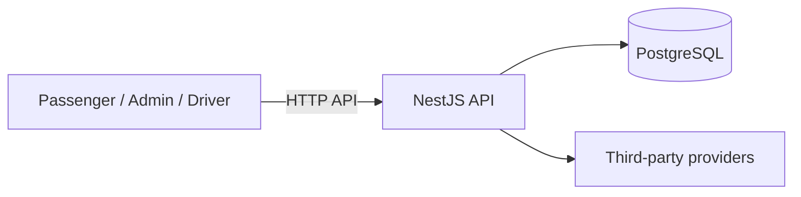

# 系統架構與責任邊界

## 產品區域

| 區域 | 技術 | 責任 |
|---|---|---|
| `src/` | uni-app / Vue | 乘客端 H5、小程序與 App Plus |
| `backend/` | NestJS / TypeScript | API、認證、權限、商業邏輯與第三方整合 |
| `admin/` | Vue 3 / Vite | 管理後台 UI 與 API 呼叫 |
| `driver/` | Flutter Web | 司機端 Web 操作介面 |
| `brand/` | 前端網站 | 品牌網站 |
| `shared/` | TypeScript | 真正跨端共用型別與契約 |
| `prisma/` | Prisma / PostgreSQL | schema 與 migration |

產品區域不得互相直接 import 實作。Admin 不可引用 passenger、backend 或 driver 的內部實作；跨端變更必須透過 API 或明確 shared contract。

## 後端責任

API 是可信任邊界，負責：

- 身份驗證與 session/token
- RBAC 與權限檢查
- 輸入驗證
- 付款、審核、退款等商業規則
- 第三方服務整合
- 資料一致性與交易
- 對前端傳入資料的再次驗證

目前 NestJS API 仍由 [`backend/src/main.ts`](../backend/src/main.ts) 組裝主要路由與生命週期；已抽出的純責任 Admin query parsing/filter/response helpers 位於 [`backend/src/admin-query.ts`](../backend/src/admin-query.ts)。此類模組化只整理內部責任，不改變 endpoint、HTTP method、權限或 response contract。

前端不可決定可信任的商業結果，也不可直接連線 PostgreSQL。

## Admin 啟動與資源載入

Admin 入口由 [`admin/src/main.js`](../admin/src/main.js) 組裝 API、狀態與頁面 Context；載入生命週期由 [`admin/src/utils/admin-load-orchestrator.js`](../admin/src/utils/admin-load-orchestrator.js) 協調，包含設定 hydration、目前管理員載入、依 view 載入資源、錯誤／session 處理及過期請求保護。`loadAdminViewResource()` 僅負責將既有 view 對應到既有 resource loader，不承載頁面模板、CSS 或業務規則。

資源實作位於 [`admin/src/utils/admin-resource-loader.js`](../admin/src/utils/admin-resource-loader.js)；此分層是逐步模組化邊界，並不表示所有頁面已完成獨立拆分。任何後續拆分都必須維持既有導航、API contract、loading/error 狀態與 UI baseline。

內置客服文字對話由 API 與 PostgreSQL 集中管理。Admin 客服頁沿用管理員身份；同一 Admin 前端部署中的 [`support-agent.html`](../admin/support-agent.html) 使用獨立客服帳戶與 session。乘客、司機與訪客各自經 API 驗證對話歸屬，兩個客服工作入口共用收件匣。圖片媒體目前只有管理端私有儲存基礎，尚未關聯客服訊息。

## 資料流



## 正式部署邊界

正式環境使用獨立 Cloud Run services：

- Passenger frontend
- Admin frontend
- Driver frontend
- NestJS API
- Share Renderer

API 使用 Cloud SQL PostgreSQL；分享圖片使用 private Cloud Storage bucket。完整發布流程請參考 [PRODUCTION-DEPLOYMENT.md](./PRODUCTION-DEPLOYMENT.md)。

## CSS 與 UI 邊界

Admin page module 必須使用唯一 root scope；共用 CSS 只放在全域基礎與共用樣式層。頁面 module 不得使用無 scope 的 `.card`、`button`、`h2`、`.active`、`body` 等 selector。

修改 Admin CSS 後執行：

```bash
npm run check:admin-style-boundaries
npm run verify:admin
```

## 設定與秘密

Secret、第三方金鑰、session secret 只能放在環境變數或正式環境 Secret Manager。不得回傳給前端或提交至 Git。

本機 PostgreSQL 是開發依賴；正式資料庫為 Cloud SQL，且 migration 由獨立 Cloud Run Job 執行。
