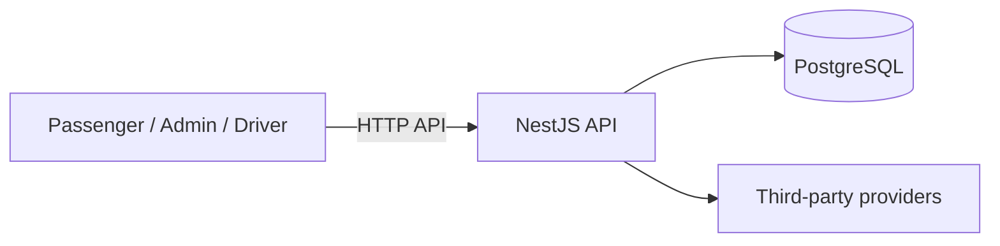

# 系統架構與責任邊界

## 產品區域

| 區域 | 技術 | 責任 |
|---|---|---|
| `src/` | uni-app / Vue | 乘客端 H5、小程序與 App Plus |
| `backend/` | NestJS / TypeScript | API、認證、權限、商業邏輯與第三方整合 |
| `admin/` | Vue 3 / Vite | 管理後台 UI 與 API 呼叫 |
| `driver/` | Flutter Web | 司機端 Web 操作介面 |
| `brand/` | 前端網站 | 品牌網站 |
| `shared/` | TypeScript | 真正跨端共用型別與契約 |
| `prisma/` | Prisma / PostgreSQL | schema 與 migration |

產品區域不得互相直接 import 實作。Admin 不可引用 passenger、backend 或 driver 的內部實作；跨端變更必須透過 API 或明確 shared contract。

## 後端責任

API 是可信任邊界，負責：

- 身份驗證與 session/token
- RBAC 與權限檢查
- 輸入驗證
- 付款、審核、退款等商業規則
- 第三方服務整合
- 資料一致性與交易
- 對前端傳入資料的再次驗證

前端不可決定可信任的商業結果，也不可直接連線 PostgreSQL。

## 資料流



## 正式部署邊界

正式環境使用獨立 Cloud Run services：

- Passenger frontend
- Admin frontend
- Driver frontend
- NestJS API
- Share Renderer

API 使用 Cloud SQL PostgreSQL；分享圖片使用 private Cloud Storage bucket。完整發布流程請參考 [PRODUCTION-DEPLOYMENT.md](./PRODUCTION-DEPLOYMENT.md)。

## CSS 與 UI 邊界

Admin page module 必須使用唯一 root scope；共用 CSS 只放在全域基礎與共用樣式層。頁面 module 不得使用無 scope 的 `.card`、`button`、`h2`、`.active`、`body` 等 selector。

修改 Admin CSS 後執行：

```bash
npm run check:admin-style-boundaries
npm run verify:admin
```

## 設定與秘密

Secret、第三方金鑰、session secret 只能放在環境變數或正式環境 Secret Manager。不得回傳給前端或提交至 Git。

本機 PostgreSQL 是開發依賴；正式資料庫為 Cloud SQL，且 migration 由獨立 Cloud Run Job 執行。
